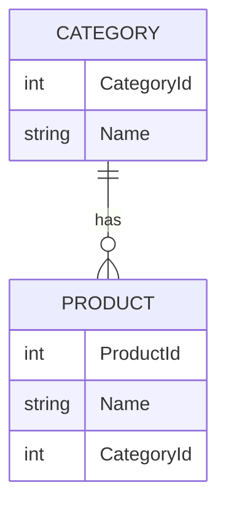

## 简介
EF Core 可用作对象关系映射程序（O/RM[^1][^2]），这可以实现以下两点：
- 使 .NET 开发人员能够使用 .NET 对象处理数据库。
- 无需再像通常那样编写大部分数据访问代码。

## 使用

### 从C# 代码生成数据库及相关查询代码

#### 通过类定义数据库表

两个表的 ER 图。



这种单纯作为数据的类即为 [POCO](https://en.wikipedia.org/wiki/Plain_old_CLR_object) 。

```c#
public class Product { 
	public int ProductId { get; set; }
	public string Name { get; set; } 
	public int CategoryId { get; set; } 
	public virtual Category Category { get; set; } 
}

public class Category { 
	public int CategoryId { get; set; } 
	public string Name { get; set; } 
	public virtual ICollection<Product> Products { get; private set; } = new ObservableCollection<Product>(); 
}
```
#### 定义数据库上下文

```c#
public class ProductContext: DbContext { 
    // DbSet 通知 EF Core 哪些 C# 实体应映射到数据库。
	public DbSet<Product> Products { get; set; } 
	public DbSet<Category> Categories { get; set; } 
    // 通过重写来指定 Sqlite 数据文件
	protected override void OnConfiguring( DbContextOptionsBuilder optionsBuilder) { 
		optionsBuilder.UseSqlite( "Data Source=products.db"); 
        // UseLazyLoadingProxies 调用指示 EF Core 实现延迟加载，因此从父实体访问时，会自动加载子实体。
		optionsBuilder.UseLazyLoadingProxies(); 
	} 
}
```

可通过多种方式配置 EF Core `DbContext`。 可以在[配置 DbContext](https://learn.microsoft.com/zh-cn/ef/core/dbcontext-configuration/) 中了解有关它们的信息。

#### 操作数据库

```c#
// 仅展示数据库相关代码
public partial class MainWindow : Window
{
    private readonly ProductContext _context =
            new ProductContext();
    
    private void LoadFromDb()
    {
        // 调用 EnsureCreated() 生成数据库。它会创建一个新的数据库。但数据库已经存在，它不会做任何操作。这对于演示是可接受的，但在生产应用中，应查看 “迁移” 来管理你的架构。
        _context.Database.EnsureCreated();

        // 加载实体到 EF Core 。
        // 代码还会同步执行，因为它使用本地 SQLite 数据库。对于通常涉及远程服务器的生产方案，请考虑使用 Load 和 SaveChanges 方法的异步版本。
        _context.Categories.Load();

        // 绑定到 View 上
        categoryViewSource.Source =
            _context.Categories.Local.ToObservableCollection();
    }
    
    private void SaveToDb()
    {
        // 所有的变更将自动的被追踪，包括删除！
        _context.SaveChanges();
    }
}
```

[迁移概述 - EF Core | Microsoft Learn](https://learn.microsoft.com/zh-cn/ef/core/managing-schemas/migrations/?tabs=dotnet-core-cli)

了解保持数据库和 EF Core 模型处于同步状态的不同方式：[管理数据库架构 - EF Core | Microsoft Learn](https://learn.microsoft.com/zh-cn/ef/core/managing-schemas/)

### 从数据库生成数据库字段的 C# 代码


### 数据库同步


[^1]: [对象关系映射 - 维基百科，自由的百科全书](https://zh.wikipedia.org/wiki/%E5%AF%B9%E8%B1%A1%E5%85%B3%E7%B3%BB%E6%98%A0%E5%B0%84)

[^2]: [ORM 实例教程 - 阮一峰的网络日志](https://www.ruanyifeng.com/blog/2019/02/orm-tutorial.html)
