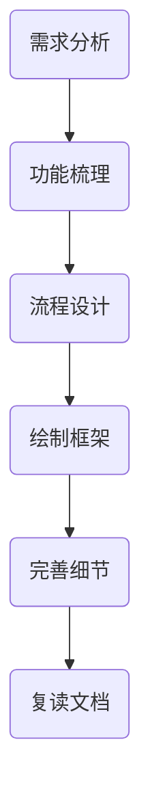
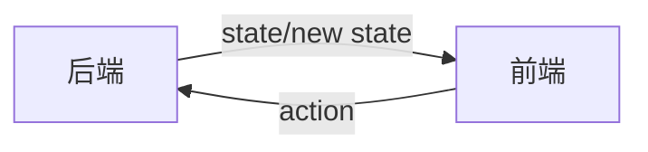
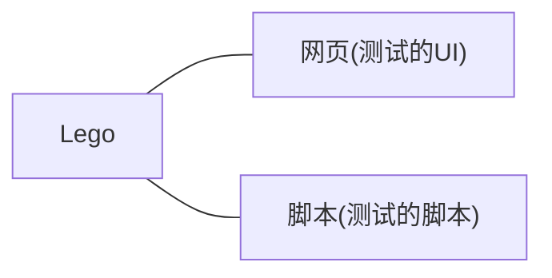

### 前端需求梳理流程

[参考](https://requirement-design.ppt.chengpeiquan.com/1)

六个梳理需求的步骤：




功能梳理


流程设计

每个流程图只对一个模块的工作思路，应分为正常流程和异常流程。

完善细节

- 需求的基本信息

  需求目的，迭代记录

- 模块的具体信息

  输入条件考虑，数据组织方式，交互效果

- 其他辅助信息

  名称解释

复读文档

检查关键词是否清晰一致。

逻辑流程是否有误。

描述是否简洁。

是否偏离需求。

#### 参考资源

产品经验，新手入门：[人人都是产品经理](https://www.woshipm.com)

设计师社区，设计思路参考：[站酷](https://www.zcool.com.cn)

互联网八卦：[钛媒体](https://www.tmtpost.com)

### TresJS 安装指南

[网址](https://tresjs.org/)

#### 安装

```bash
# TresJS (Vue3版)
npm install three @tresjs/core
# TresJS在TS里的类型系统
npm install @types/three -D
```

#### 配置

在 Vite 的 `vite.config.ts` 里配置相关参数

```ts
import { templateCompilerOptions } from '@tresjs/core'

export default defineConfig({
  plugins: [
    vue({
      // Other config
      ...templateCompilerOptions
    }),
  ]
})
```


### React、Flux、Redux 概念之间的关系

[参考](https://www.zhihu.com/question/47686258/answer/107209140)

早期前端的 View 是根据后端的 state 来刷新整个页面。



优点：前端只负责刷新页面，逻辑简单（单向流）。

缺点：当页面变复杂后，每次刷新都会耗费巨大资源。

解决方案：React 通过虚拟 DOM 来更新页面解决了每次刷新都会耗费巨大资源的问题。

### JS 的 Excel 处理库

[网址](https://sheetjs.com/)

#### 安装

```bash
npm rm --save xlsx
npm i --save https://cdn.sheetjs.com/xlsx-0.20.1/xlsx-0.20.1.tgz
```

#### 使用

`XLSX.read(data, options)`

`data` 为文本数据；[`options`](https://docs.sheetjs.com/docs/api/parse-options#input-type) 是一些可选参数，默认文件格式为 Base64，如果为UTF-8，则需指定 [`type`](https://docs.sheetjs.com/docs/api/parse-options#input-type) 为 string. 返回一个 [workbook](https://docs.sheetjs.com/docs/csf/book/) 对象。

#### 例子

```js
function processFile(file, fileList){
    // 读取文件
    let reader = new FileReader()
    reader.readAsText(file.raw)
	
    // 处理文件内容
    reader.onload = (e) => {
    // 解析文件内容
    const fileString = e.target.result
    const content = read(fileString, {type: "string"})
    // 接下来可对文件内容进行处理
    let array = []
    // 此处是将B1 - B3的数字提取到数组中
    for (let i = 1; i < 4; i++) {
      // 默认B1开始
      array.push(content.Sheets["Sheet1"][`B${i}`].v)
    }
}
```

### Threejs

#### Threejs 中的光源

| 名字                   | 描述                                                         | 能否创建阴影 |
| ---------------------- | ------------------------------------------------------------ | ------------ |
| THREE.AmbientLight     | 这是一个基本光源，该光源的颜色将会叠加到场景现有物体的颜色上 |              |
| THREE.PointLight       | 这是一个点光源，从空间的一点向所有方向发射光线。点光源不能用来创建阴影 |              |
| THREE.SpotLight        | 这种光源有聚光的效果，类似台灯、天花板上的品灯或者手电筒。这种光源可以投射阴影 | 能           |
| THREE.DirectionalLight | 这种光源也称作无限光。从这种光源发出的光线可以看作是平行的，打个比方，就像太阳光，这种光源也可以用来创建阴影 | 能           |
| THREE.HemisphereLight  | 这是一种特殊的光源，可以通过模拟反光面和光线微弱的天空来创建更加自然的室外光线。这个光源也不提供任何与阴影相关的功能 |              |
| THREE.AreaLight        | 使用这种光源可以指定散发光线的平面，而不是一个点。AreaLight 不投射任何阴影 |              |
| THREE.LensFlare        | 这不是一种光源，但是通过使用 THREE.LensFare，可以为场景中的光源添加镜头光晕效果 |              |

#### Threejs中的材质

| 名称                                   | 描述                                                         | 是否受光照影响 |
| -------------------------------------- | ------------------------------------------------------------ | -------------- |
| MeshBasicMaterial（网格基瑞材质）      | 基础材质，用于给几何体赋予一种简单的颜色，可者显示几何体的线框 |                |
| MeshDepthMaterial（网格深度材质）      | 这个材质使用从摄像机到网格的距离来决定如响给网格上色         |                |
| MeshNormalMaterial（网格法向材质）     | 这是一种简单的材质，根据法向向量计算物体表面的颜色           |                |
| MeshLambertMaterial（网格Lambert材质） | 这是一种考虑光照影响的材质，用于创建略淡的、不光亮的物体     | 是             |
| MeshPhongMaterial（网格Phong式材质）   | 这是一种考虑光照影响的材质，用于创建光亮的物体               | 是             |
| MeshStandardMaterial（网格标准材质）   | 这种标准材质使用“基于物理的渲染（PBR）”算法来绘制物体表面。它能够计算出表面与光线的正确互动关系，从而使渲染出的物体看起来更加真实 | 是             |
| MeshPhysicalMaterial（网格物理材质）   | 这是 MeshStandardMaterial 的扩展材质，它为光线反射计算模型提供了更多的控制 | 是             |
| MeshToonMaterial（网格卡通材质）       | 这是 MehPhongMaterial 的扩展材质，它使得物体渲染更加卡通化   | 是             |
| ShadowMaterial（阴影材质）             | 这是一个专门用于接收阴影图的特殊材质。在该材质中只有阴影图像，非阴影部分为完全透明的区城 |                |
| ShaderMaterial（着色器材质）           | 这种材质允许使用自定义的着色器程序，直接控制顶点的放置方式以及像素的着色方式 |                |
| LineBasicMaterial（直线基础材质）      | 这种材质可以用于 THREE.Line（直线）几何体，用来创建着色的线  |                |
| LineDashMaterial（虚线材质）           | 这种材质与 LineBasicMaterial（直线基础材质）一样，但允许创键出一种虚线的效果 |                |

哑光材质在 Threejs 和 KeyShot 里渲染较为一致。

### Lego

#### Lego 的组成



具体构成


#### Lego 测试用例执行流程


