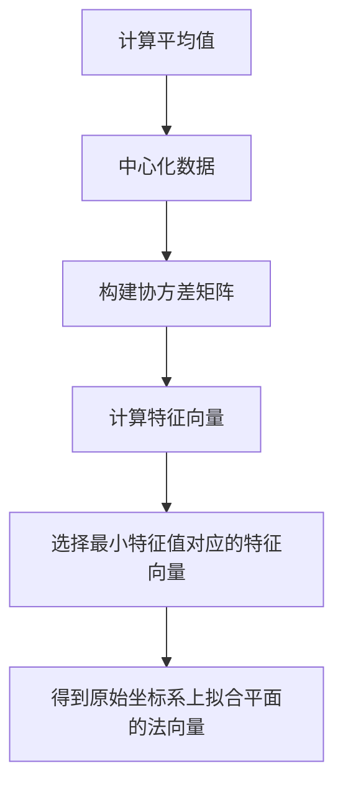

平面拟合是指通过一组离散的点数据，找到最符合这些点数据的平面模型。常用的平面拟合方法之一是[最小二乘法（Least Squares Method）](https://zh.wikipedia.org/zh-cn/最小二乘法)。

### 计算步骤

目的是计算出原始坐标系上拟合平面的法向量。

1. 计算平均值：通过平均一组包含离散点的数据集，得到平均点。

2. 中心化数据：将平均点作为原点，计算数据集中的每个点坐标的新坐标。
3. 构建协方差矩阵：根据中心化后的数据集，计算协方差矩阵。协方差矩阵描述了数据集中各个坐标之间的相关性。
4. 计算特征向量：对协方差矩阵进行特征值分解，得到特征值和对应的特征向量。特征向量表示了数据集中的主要方向。
5. 选择最小特征值对应的特征向量：根据特征值的大小，选择对应最小特征值的特征向量。这个特征向量即为最符合数据集的法向量，也即拟合的平面的法向量。
6. 得到原始坐标系上拟合平面的法向量：将计算得到的法向量转换回原始坐标系，得到拟合平面的法向量。

### 原理

根据三维点到平面距离最近进行拟合
$$
d=\frac{|Ax+By+Cz+D|}{\sqrt{A^2+B^2+C^2}}
$$
则可知当距离和最短时有最小值，同时可直接对 $d$ 求平方进行表示，其具有相同的变化趋势则即是求
$$
\min S=\min \sum(Ax_i+By_i+Cz_i+D)^2
$$
取偏导可得
$$
\begin{array}
&\frac {\partial S}{\partial A} = 2(Ax_i+By_i+Cz_i+D)x_i \\
\frac {\partial S}{\partial B} = 2(Ax_i+By_i+Cz_i+D)y_i \\
\frac {\partial S}{\partial C} = 2(Ax_i+By_i+Cz_i+D)z_i \\
\frac {\partial S}{\partial D} = 2(Ax_i+By_i+Cz_i+D)
\end{array}
$$
根据平面方程可将 $C$ 消去
$$
\frac A C x+\frac B C y+z+\frac D C =0
$$
于是可直接令 $C = 1$，则可得
$$
\left[
\begin{matrix}
\sum x_i^2 & \sum x_iy_i & \sum x_i \\
\sum x_iy_i & \sum y_i^2 & \sum y_i \\
\sum x_i & \sum y_i & \sum 1 
\end{matrix} \right]\ 
\left[
\begin{matrix}
A \\
B \\
D 
\end{matrix} \right]\ =
\left[
\begin{matrix}
-\sum x_iz_i  \\
-\sum y_iz_i \\
-\sum z_i  
\end{matrix} \right]\
$$
求逆即可求到 $A、B、D$ 获得平面信息