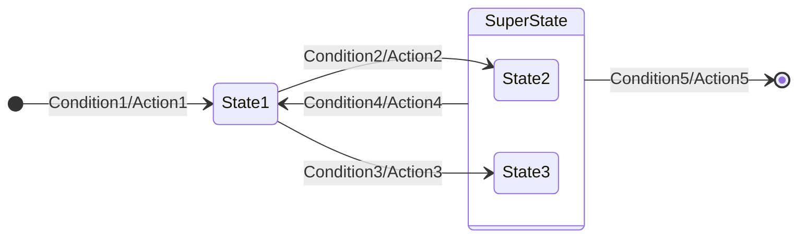
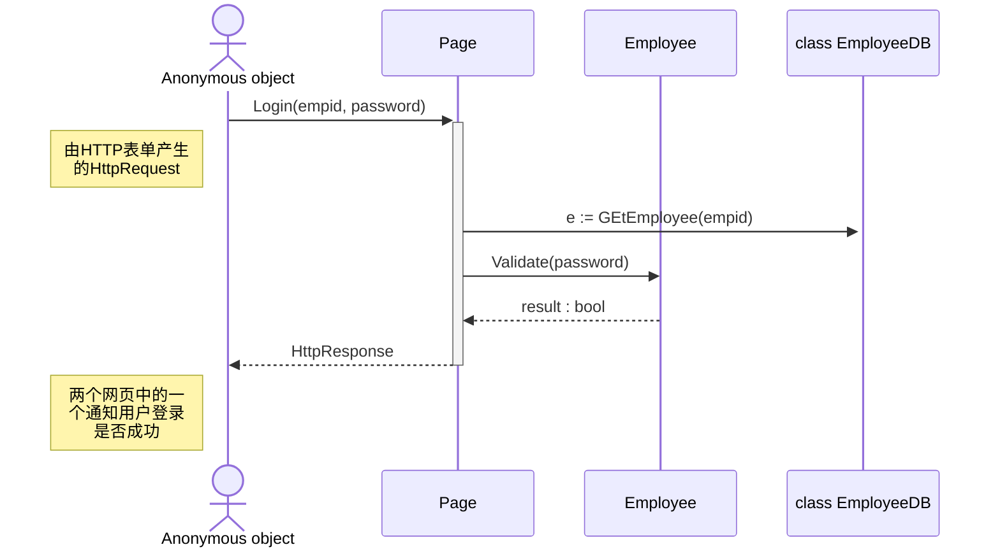
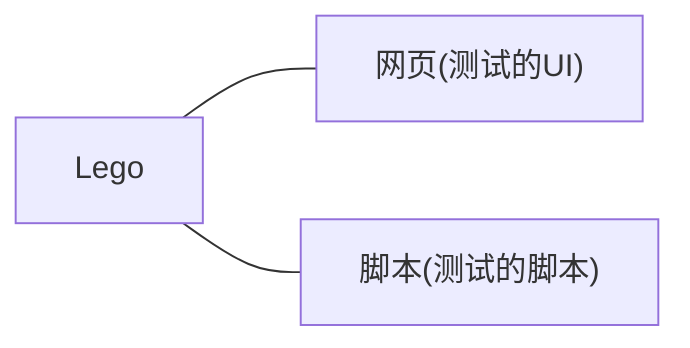
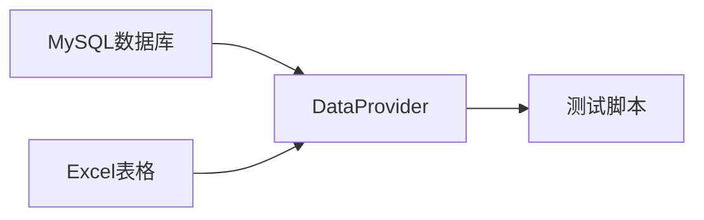
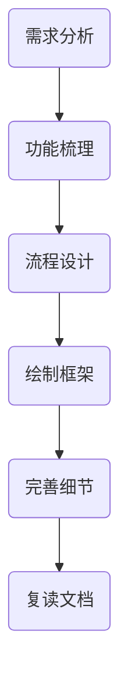
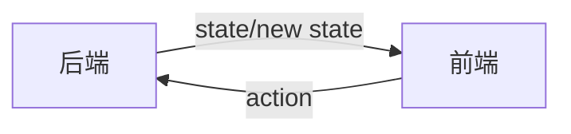

### C#中的按值和按引用传递

按值传递给函数时，变量传递的是副本；按引用传递给函数时，变量传递的是本身。

#### 按值传递[^1]

1. 整数类型（如int、long、short）、
2. 浮点数类型（如float、double、decimal）、
3. 布尔类型（bool）、
4. 字符型（char）、
5. 枚举类型（enum）、
6. [结构类型](https://learn.microsoft.com/zh-cn/dotnet/csharp/language-reference/builtin-types/struct)（struct）。

#### 按引用传递[^2]

1. 类（class）、
2. 接口（interface）、
3. [委托](https://learn.microsoft.com/zh-cn/dotnet/csharp/language-reference/builtin-types/reference-types#the-delegate-type)（delegate）、
4. [记录](https://learn.microsoft.com/zh-cn/dotnet/csharp/language-reference/builtin-types/record)（record）、
5. [内置引用类型](https://learn.microsoft.com/zh-cn/dotnet/csharp/language-reference/builtin-types/reference-types)（dynamic、object、string）

`in` 修饰符允许编译器为自变量创建一个临时变量，并传递对该自变量的只读引用[^3]。

`ref` 关键字会将修饰的变量按引用传递[^4]。

`out` 修饰符会在函数返回之前给变量赋值[^5]。


### [MySQL 8.0参考手册](https://dev.mysql.com/doc/refman/8.0/en/)


### [JSON数据类型](https://dev.mysql.com/doc/refman/8.0/en/json.html#json-values)


### UML

#### 状态图

描述在不同状态切换的图。

##### 表示方法

###### 图表示



当两个或多个状态会在同一条件下执行同一操作转到另一状态时，可用`SuperState`表示。

###### 表格表示

| 当前状态   | 事件       | 新状态 | 动作    |
| ---------- | ---------- | ------ | ------- |
| 起始       | Condition1 | State1 | Action1 |
| State1     | Condition2 | State2 | Action2 |
| State1     | Condition3 | State3 | Action3 |
| SuperState | Condition4 | State1 | Action4 |
| SuperState | Condition5 | 结束   | Action5 |

在开发和维护有限状态机（FSM）方面，采用文本语言通常要比图形更容易一些。


#### 时序图

描述物件在时间序列中的交叉作用[^6]。




### 测试

#### 单元测试的五个级别

[参考](https://www.zhihu.com/question/27313846/answer/120164282)

1. Level 1：正常流程可用，即一个函数在输入正确的参数时，会有正确的输出
1. Level 2：异常流程可抛出逻辑异常，即输入参数有误时，不能抛出系统异常，而是用自己定义的逻辑异常通知上层调用代码其错误之处
1. Level 3：极端情况和边界数据可用，对输入参数的边界情况也要单独测试，确保输出是正确有效的
1. Level 4：所有分支、循环的逻辑走通，不能有任何流程是测试不到的
1. Level 5：输出数据的所有字段验证，对有复杂数据结构的输出，确保每个字段都是正确的

一般只做到Level 2，重要系统或者底层服务，要做到Level 3或Level 4。极为关键的才做到Level 5.

#### 3条简单的规则

1. 除非已经编写了一个不能通过的单元测试，否则不编写任何产品代码；

2) 只要编写能够正好导致测试不通过或者编译失败的单元测试就够了；

3) 只要编写能够正好使失败的单元测试通过的产品代码就够了。

#### 作用

1. 保证程序中的每一项功能都有测试来验证它的操作的正确性；

2. 迫使我们从调用者的视角去观察将要编写的程序，以设计出便于调用的软件；

3. 首先编写测试迫使我们解除软件中的耦合；
4. 测试可以作为一种非常有价值的文档，帮助其人了解如何使用代码。

#### 测试方法

##### 基于意图编程

先在测试中陈述意图，并使你的意图尽可能地简单、易读。

##### 单元测试

是用来验证系统中单个机制的白盒测试（white-box test）。

##### 验收测试

是用来验证系统满足客户需求的黑盒测试（black-box test）；是关于一项特性的最终文档。一旦编写完成了验证一项特性的验收测试，就可以阅读那些验收测试来真正地理解这项特性。即验收测试是真正的需求文档。

[FitNesse](https://fitnesse.org/FrontPage.html)可以以简单Web页面的形式来编写每个验收测试，并从Web浏览器来访问和运行。

##### 最佳实践

[参考](https://learn.microsoft.com/zh-cn/dotnet/core/testing/unit-testing-best-practices)

- 测试的名称应包括三个部分：要测试的方法的名称、测试的方案、调用方案时的预期行为。

- 单元测试步骤：
  1. Arrange：安排对象，根据需要对其进行创建和设置，
  2. Act：作用于对象，
  3. Assert：断言某些项按预期进行。 

- 编写单元测试时，请避免手动字符串串联、逻辑条件（例如 `if`、`while`、`for` 和 `switch`）以及其他条件。

- 在编写测试时，请尝试每次测试只包含一个操作。 

例：

```c#
[TestMethod]
// 以下每个为一次测试
[DataRow("0,0,0", 0)]
[DataRow("0,1,2", 3)]
[DataRow("1,2,3", 6)]
// 方法名称_测试方案_预期行为
public void Add_MultipleNumbers_ReturnsSumOfNumbers(string input, int expected)
{
    // Arrange
    var stringCalculator = new StringCalculator();
	// Act
    var actual = stringCalculator.Add(input);
	// Assert
    Assert.Equal(expected, actual);
}
```

[数据源属性](https://learn.microsoft.com/zh-cn/visualstudio/test/how-to-create-a-data-driven-unit-test?view=vs-2022)

DataRow

使用指定的值连续运行。

```c#
[TestMethod]
[DataRow(1, 1, 2)]
[DataRow(2, 2, 4)]
[DataRow(3, 3, 6)]
[DataRow(0, 0, 1)] // The test run with this row fails
public void AddIntegers_FromDataRowTest(int x, int y, int expected)
{
    var target = new Maths();
    int actual = target.AddIntegers(x, y);
    Assert.AreEqual(expected, actual,
        "x:<{0}> y:<{1}>",
        new object[] {x, y});
}
```

DynamicData

使用数据成员的值作为输入。

```c#
public static IEnumerable<object[]> AdditionData
{
    get
    {
        return new[]
        { 
            new object[] { 1, 1, 2 },
            new object[] { 2, 2, 4 },
            new object[] { 3, 3, 6 },
            new object[] { 0, 0, 1 }, // The test run with this row fails
        };
    }
}

[TestMethod]
[DynamicData(nameof(AdditionData))]
public void AddIntegers_FromDynamicDataTest(int x, int y, int expected)
{
    var target = new Maths();
    int actual = target.AddIntegers(x, y);
    Assert.AreEqual(expected, actual,
        "x:<{0}> y:<{1}>",
        new object[] {x, y});
}
```

DataSource

使用指定源的数据。

```c#
[TestMethod]
/*
三种不同的构造函数
[DataSource(dataSourceSettingName)]

[DataSource(connectionString, tableName)]

[DataSource(
    dataProvider,
    connectionString,
    tableName,
    dataAccessMethod
    )]
*/
[DataSource(@"Provider=Microsoft.SqlServerCe.Client.4.0; Data Source=C:\Data\MathsData.sdf;", "Numbers")]
public void AddIntegers_FromDataSourceTest()
{
    var target = new Maths();

    // Access the data
    int x = Convert.ToInt32(TestContext.DataRow["FirstNumber"]);
    int y = Convert.ToInt32(TestContext.DataRow["SecondNumber"]);
    int expected = Convert.ToInt32(TestContext.DataRow["Sum"]);
    int actual = target.AddIntegers(x, y);
    Assert.AreEqual(expected, actual,
        "x:<{0}> y:<{1}>",
        new object[] {x, y});
}
```


### Lego

#### Lego的组成



具体构成


#### Lego测试用例执行流程


#### 数据驱动测试

从数据库其他数据源中获取测试用例。

优势：学习和迁移成本低 都会比较低。

数据流向图



通过DataProvider将不同数据转换为统一的格式，便于解耦合和测试脚本使用。


### 类设计

#### 最佳实践

类是暴露抽象最优先的选择。因为接口一旦发布，其成员将永远固定。所以要优先定义类而不是接口。

要用抽象类而不是用接口来解除契约与实现之间的耦合，除非接口永不变[^7]。

一个接口只做一件事情。

通过接口来实现多重继承，但要避免记号接口（没有成员的接口）[^8]。

仅把最长的重载成员定义成重载成员中唯一的虚成员，而较短的重载只是调用一下较长的重载。

```c#
public class String{
    public int Indexof(string s){
        return Indexof(s,0);
    }
	public int Indexof(string s,int startIndex){
        return Indexof(s,startIndex,s.Length);
    }
	public virtual int Indexof(string s,int startIndex,int count){
        //do real work here
    }
}
```

要优先使用成员重载，而不是定义有默认参数的成员[^9]。


### TDD概要

[参考](https://github.com/hxfirefox/blog/blob/master/TDD/img/oo2rd_pub_1.png)


#### What

以先写测试用例的方式定义出代码的行为，然后缩写产品代码使得用例通过，从而实现功能代码

#### Why

- 通过测试来正确的反应业务需求
- 需求仅仅为了完成测试，不会产生多余的代码
- 对功能完成情况给出快速及时反馈，帮助开发小步快跑，每一步都是正确的
- 可重复的，代价低廉的自动化测试时刻帮助验证程序的正确性

#### How

- 任务分解
- 转化成为测试
- 使测试通过
- 要点
  - 测试先行
  - 小测试
  - 快速反馈


### 《测试驱动开发》笔记

#### 处理任务的方式

> 我养成了这样的习惯，把我想在以后几个小时之内完成的任何事情都记录在电脑旁的一张纸上。我还有一张这样的请单，我把它钉在墙上，不过这张单子是这一周或者这个月的工作计划。一旦把所有要完成的事情都写在清单上，我就知道我是不会忘记去做这些事情了。当又有新条目出现时，我会迅速而有意识地判断这个条目是属于“现在的”清单还是“以后的”清单，还是它根本就不需要去做。
>
> 将其运用到测试驱动开发上，那么我们记录到列表上的就是我们要去实现的测试。首先，把你所知道需要实现的每种操作的范例都记录在清单上，其次，对于那些目前还不存在的操作，将其空（null）版本记录到清单上。最后，列出所有你认为在这一轮编程结束后为了获得整洁的代码而必须要完成的重构。

进行短频快的测试，而不是积累后再测试。

将测试中新增的测试项添加到列表中，如果超出目前任务的需求，则将当前任务列表中不重要不紧急的移动到“以后的”列表上。

#### 如何编写断言

- 我们应该从哪儿开始构建一个系统？从我们对最终系统的描述开始。
- 我们应该从哪儿开始编写一项功能？从我们希望最终代码能够通过的测试开始。
- 我们应该从哪儿开始写一个测试？从测试完成时能够通过的断言开始。


### 重写相等操作

- 相等操作要满足数学上相等的定义：

  [参考](https://www.cnblogs.com/yyfh/p/12245916.html)

  - 自反性、

    x.equals(x)等于true

  - 对称性、

    x.equals(y)等于y.equals(x)

  - 传递性、

    x.equals(y)返回true，并且y.equals(z)也返回true，那么x.equals(z)必须返回true

  - 一致性、

    如果多次将对象与另一个对象比较，结果始终相同。只要未修改x和y的应用对象，x.equals(y)连续调用x.equals(y)返回相同的值

  - 非null

    如果x不是null，y为null，则x.equals(y)必须为false

- 重载等于操作时需要实现的接口

  `Equals(object?)`和`GetHashCode()`可以用VS默认实现[^10]，或参考下面的样例代码。

  ```c#
  public class Example : IEquatable<Example>
  {
      public int Member1;
      public double Member2;
      public static bool operator ==(Example left, Example right)
      {
          return left.Member1 == right.Member1 && left.Member2 == right.Member2;
      }
      
      public static bool operator !=(Example left, Example right)
      {
          return left.Member1 != right.Member1 || left.Member2 != right.Member2;
      }
      
      public override bool Equals([NotNullWhen(true)] object? obj)
      {
          return GetType() != obj?.GetType() || Equals(obj);
      }
      
      public bool Equals(Example? other)
      {
          return other is not null && (ReferenceEquals(this, other) || other == this);
      }
      
      public override int GetHashCode()
      {
          return HashCode.Combine(Member1, Member2);
      }
  }
  ```

  `operator==`和`Equals`要在语义上相等。

  由于重载了`operator==`，`Object.Equals(object?)`语义要与其一致，则需重载；而`Object.Equals(object?)`改变后会影响`Object.GetHashCode()`，也需要重载。


### 前端需求梳理流程

[参考](https://requirement-design.ppt.chengpeiquan.com/1)

六个梳理需求的步骤：




功能梳理


流程设计

每个流程图只对一个模块的工作思路，应分为正常流程和异常流程。

完善细节

- 需求的基本信息

  需求目的，迭代记录

- 模块的具体信息

  输入条件考虑，数据组织方式，交互效果

- 其他辅助信息

  名称解释

复读文档

检查关键词是否清晰一致。

逻辑流程是否有误。

描述是否简洁。

是否偏离需求。

#### 参考资源

产品经验，新手入门：[人人都是产品经理](https://www.woshipm.com)

设计师社区，设计思路参考：[站酷](https://www.zcool.com.cn)

互联网八卦：[钛媒体](https://www.tmtpost.com)


### TresJS安装指南

[网址](https://tresjs.org/)

#### 安装

```bash
# TresJS (Vue3版)
npm install three @tresjs/core
# TresJS在TS里的类型系统
npm install @types/three -D
```

#### 配置

在 Vite 的`vite.config.ts`里配置相关参数

```ts
import { templateCompilerOptions } from '@tresjs/core'

export default defineConfig({
  plugins: [
    vue({
      // Other config
      ...templateCompilerOptions
    }),
  ]
})
```


### React,Flux,Redux概念之间的关系

[参考](https://www.zhihu.com/question/47686258/answer/107209140)

早期前端的View是根据后端的state来刷新整个页面。



优点：前端只负责刷新页面，逻辑简单（单向流）。

缺点：当页面变复杂后，每次刷新都会耗费巨大资源。


解决方案：React通过虚拟DOM来更新页面解决了每次刷新都会耗费巨大资源的问题。


### C#的WebSocket处理

```c#
[ApiController]
[Route("[controller]")]
public class ExampleWsController : ControllerBase
{
    private WebSocket socket;

    private void SendMessage(string message)
    {
        socket.SendAsync(new ArraySegment<byte>(Encoding.UTF8.GetBytes(message)), WebSocketMessageType.Text, true, CancellationToken.None);
    }

    private async Task HandleWebSocket()
    {
        try
        {
            while (socket.State == WebSocketState.Open)
            {
                var buffer = new byte[1024 * 4];
                var result = await socket.ReceiveAsync(new ArraySegment<byte>(buffer), CancellationToken.None); // 获得客户端消息
                while (!result.CloseStatus.HasValue)
                {
                    // 解析请求后按不同情况处理
                    var messageFromClient = Encoding.UTF8.GetString(buffer, 0, result.Count);
                    switch (messageFromClient)
                    {
                        case "message1":
                            break;
                        case "message2":
                            break;
                        case "message3":
                            break;
                    }
                }
            }
        }
        catch (Exception ex)
        {
            // Handle exceptions
        }
        finally
        {
            if (socket.State == WebSocketState.Open)
                await socket.CloseAsync(WebSocketCloseStatus.NormalClosure, "Connection closed by client", CancellationToken.None);
        }
    }

    [HttpGet("GetExampleWs")]
    public async Task GetExampleWs()
    {
        if (HttpContext.WebSockets.IsWebSocketRequest)
        {
            // 建立连接
            socket = await HttpContext.WebSockets.AcceptWebSocketAsync();
            await Task.Run(() => HandleWebSocket());
        }
        else
        {
            HttpContext.Response.StatusCode = 400;
        }
    }
}
```

`GetExampleWs()`用于建立ws连接，请求url路径为`ws://localhost/ExampleWs/ExampleWs`.

`HandleWebSocket()`用于处理发送过来的请求，或者向对方发送消息。


### 《软件建模与设计》

#### 面向对象方法与统一建模语言

现代面向对象分析和设计过程中都综合使用了用例建模、静态建模、状态机建模和对象交互建模。

用例建模：系统的功能性需求按照用例和参与者进行定义。

静态建模：提供系统的结构化视图。类按照其属性以及与其他类的关系进行定义。

对象交互建模：通过对象交互图显示对象之间是如何通信以实现用例。

状态机建模：通过状态图表示系统的相关状态及关系。

#### 方法和表示法

软件设计表示法：使用图形或文本方式或同时使用图形和文本描述软件设计的方法。

软件设计思想：用于设计系统的根本性的思想。

软件设计策略：是一种对设计的整体性规划和方向性指导。

软件结构组织准则：用于帮助设计者将软件系统组织为构件的启发式规则或指导方针。

软件设计方法：是一种描述了用于在给定的应用系统软件需求基础上创建一个设计方案的步骤序列的系统化方法。

#### 软件体系结构的多视图

- 用例视图
  该视图是一种功能性需求视图，是软件体系结构设计的输入。每个用例描述了一个或多个参与者（外部用户）与系统之间的交互序列。
- 静态视图
  该视图用类以及类间关系描述体系结构，其中的关系包括关联、整体/部分（组合或聚合)、泛化/特化关系。表示为UML类图。
- 动态交互视图
  该视图通过对象以及对象间的消息通信来描述体系结构。该视图也可以用来描述特定场景的执行序列。表示为UML通信图。
- 动态状态机视图
  一个控制构件的内部控制和定序可以用状态机来描述。表示为UML状态图。
- 结构构件视图
  该视图用构件来描述软件体系结构，构件间通过端口互联，支持供给接口和请求接口的描述。表示为UML结构化类图。
- 动态并发视图
  该视图将软件体系结构描述为在分布式结点上执行并且通过消息进行通信的并发构件。表示为UML并发通信图。
- 部署视图
  该视图描述分布式体系结构中构件如何分配到不同硬件结点上的特定配置。表示为UML部署图。


[^1]: [值类型 - C# | Microsoft Learn](https://learn.microsoft.com/zh-cn/dotnet/csharp/language-reference/builtin-types/value-types)
[^2]: [引用类型 - C# | Microsoft Learn](https://learn.microsoft.com/zh-cn/dotnet/csharp/language-reference/keywords/reference-types)
[^3]: [`in` 修饰符 - C# | Microsoft Learn](https://learn.microsoft.com/zh-cn/dotnet/csharp/language-reference/keywords/method-parameters#in-parameter-modifier)
[^4]:[`ref` 关键字 - C# | Microsoft Learn](https://learn.microsoft.com/zh-cn/dotnet/csharp/language-reference/keywords/ref)
[^5]: [`out` 修饰符 - C# | Microsoft Learn](https://learn.microsoft.com/zh-cn/dotnet/csharp/language-reference/keywords/method-parameters#out-parameter-modifier)
[^6]: [时序图 - 维基百科](https://zh.wikipedia.org/zh-cn/时序图)
[^7]: P~77~ | .NET设计规范：约定、惯用法与模式（第2版）
[^8]: 4.6 接口设计 P~82~ | .NET设计规范：约定、惯用法与模式（第2版）
[^9]: P~106~ | .NET设计规范：约定、惯用法与模式（第2版）
[^10]: [生成 C# Equals 和 GetHashCode 方法重写 - Visual Studio (Windows) | Microsoft Learn](https://learn.microsoft.com/zh-cn/visualstudio/ide/reference/generate-equals-gethashcode-methods?view=vs-2022)
