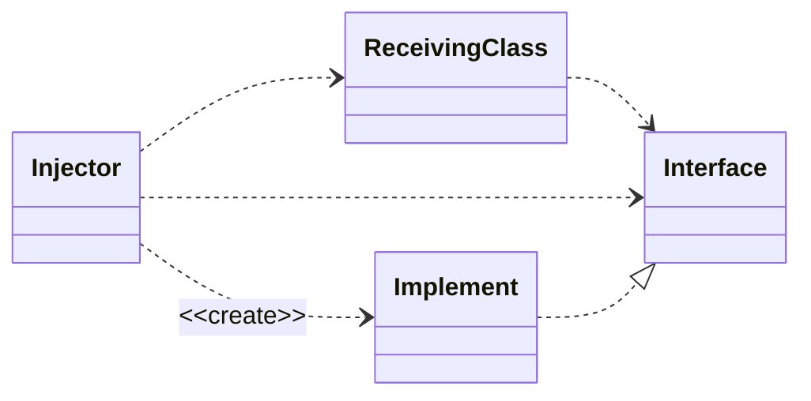
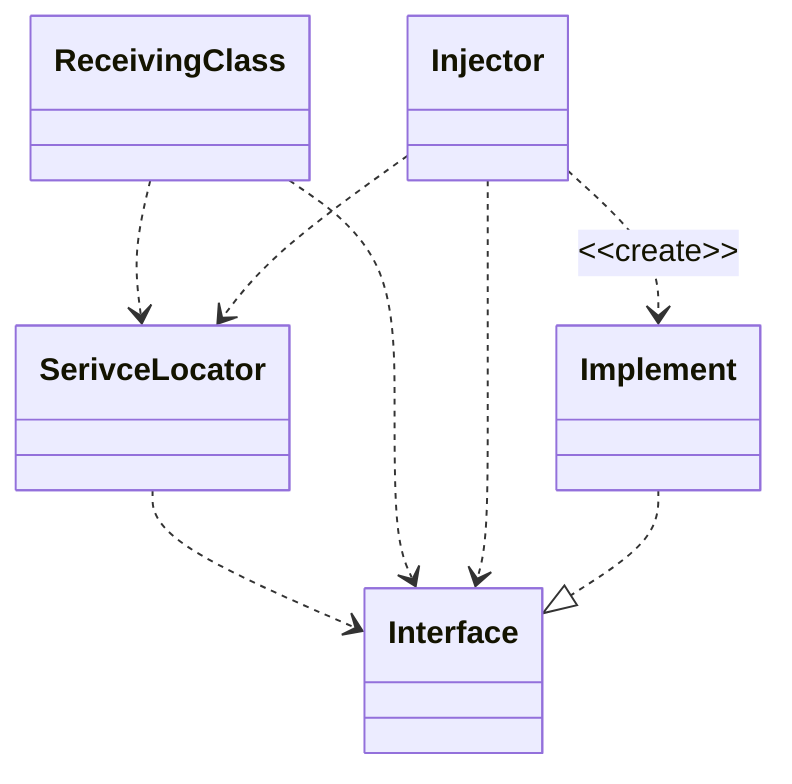
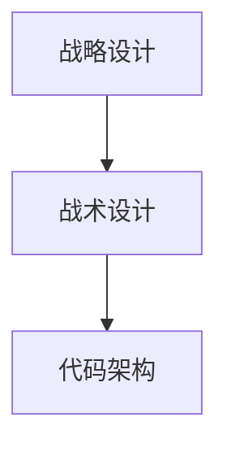
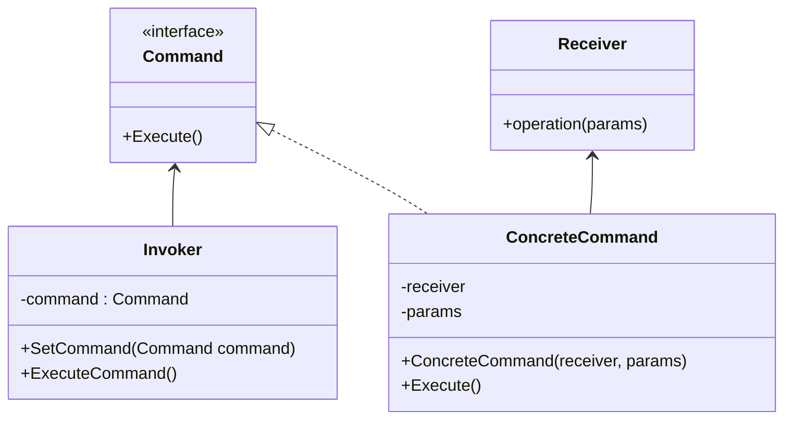

## MVVM Toolkit工具包

[官网](https://learn.microsoft.com/zh-cn/dotnet/communitytoolkit/mvvm/)

建议使用平台：.Net 8，较早的平台可能会出现奇怪的Bug。

[观察属性](https://learn.microsoft.com/zh-cn/dotnet/communitytoolkit/mvvm/generators/observableproperty)

用法

```c#
[ObservableProperty]
private string? name;
```

等价于

```c#
public string? Name
{
    get => name;
    set => SetProperty(ref name, value);
}
```

> [!NOTE]
>
> 带批注字段需要位于具有必要 `INotifyPropertyChanged` 基础结构的[分部类](https://learn.microsoft.com/zh-cn/dotnet/csharp/programming-guide/classes-and-structs/partial-classes-and-methods)中才能发挥作用。
>
> 将基于字段名称创建生成的属性的名称。 字段命名采用 `lowerCamel`、`_lowerCamel` 或者 `m_lowerCamel`，都会转换为 `UpperCamel`。 生成的属性将始终具有公共访问器，但在声明该字段时可以使用任何可见性（建议使用 `private`）。


[中继命令属性](https://learn.microsoft.com/zh-cn/dotnet/communitytoolkit/mvvm/generators/relaycommand)

用法

```c#
[RelayCommand]
private void GreetUser()
{
    
}
```

等价于

```c#
private RelayCommand? greetUserCommand;

public IRelayCommand GreetUserCommand => greetUserCommand ??= new RelayCommand(GreetUser);
```

> [!Note]
>
> 为了正常工作，带批注的方法需要位于[分部类](https://learn.microsoft.com/zh-cn/dotnet/csharp/programming-guide/classes-and-structs/partial-classes-and-methods)中。 如果对类型进行嵌套，则必须也将声明语法树中的所有类型批注为分部。 
>
> 将基于方法名称创建生成的命令的名称。 生成器将使用方法名称并在末尾追加“Command”，并且去除“On”前缀（如果存在）。 此外，对于异步方法，“Async”后缀也会在追加“Command”之前去除。


## IOC（控制反转）

[参考](https://learn.microsoft.com/zh-cn/dotnet/communitytoolkit/mvvm/ioc)

使用 MVVM 模式提高应用程序代码库中的模块化程度的最常用模式是使用某种形式的反转控制。其中有一种最常见的解决方案使用DI（[依赖关系注入](https://www.freecodecamp.org/chinese/news/a-quick-intro-to-dependency-injection-what-it-is-and-when-to-use-it/)），该解决方案存在于创建多个注入后端类的服务（即以参数的形式传递给 viewmodel 构造函数）的过程中，这允许使用这些服务的代码不依赖这些服务的实现详细信息，并且也可以轻松地交换这些服务的具体实现。 

所需包：`Microsoft.Extensions.DependencyInjection`

### 配置和解析服务

```c#
public sealed partial class App : Application
{
    public App()
    {
        Services = ConfigureServices();

        InitializeComponent();
    }

    /// <summary>
    /// 获取当前使用中的 <see cref="App"/> 实例
    /// </summary>
    public new static App Current => (App)Application.Current;

    /// <summary>
    /// 当前App实例中的 <see cref="IServiceProvider"/> 实例
    /// </summary>
    public IServiceProvider Services { get; }

    /// <summary>
    /// 注册依赖的函数
    /// </summary>
    private static IServiceProvider ConfigureServices()
    {
        var services = new ServiceCollection();
		
        // 注册接口和对应的实现类
        services.AddSingleton<InterfaceClass, ImplClass>();
        
        // 注册视图模型
		services.AddSingleton<XxxViewModel>();
        
        return services.BuildServiceProvider();
    }
}
```

### 使用

```c#
InterfaceClass c = App.Current.Services.GetService<InterfaceClass>();

var vm = App.Current.Services.GetService<XxxViewModel>();
```

### 区别

`AddSingleton()`在第一次请求时创建服务的单个实例，并在需要该服务的所有位置复用该实例（单例模式）。

`AddTransient()`在第每次请求时创建服务的一个实例。

`AddScoped()`在给定的 http 请求范围内获得相同的实例，但跨不同的 http 请求获得新实例。

### IOC的注入方式

依赖注入的基本思想是使用一个单独的对象（即注入器[^1]）来填充接收类中的依赖对象。



使用服务定位

服务定位背后的基本思想是拥有保存所有依赖对象的单例，它有一个能返回依赖对象的方法。




### IOC的三种实现方式

#### Interface Injection（接口注入）

通过接口提供的注入方法来注入依赖对象。

例：

```c#
interface Inject {
    // 注入接口
    public void SetDependency(Object o);
}

// 依赖对象
class B {
    // ...
}

// 接收方
class A : Inject {
    B b;
    // 注入接口的具体实现
    public override void SetDependency(Object o) {
        this.b = o as B;
    }
    // ...
}
```


#### Setter Injection（Setter注入）

通过接收方提供的注入方法注入依赖对象。

例：

```c#
// 依赖对象
class B {
    // ...
}

// 接收方
class A {
    B b;
    // Setter方法
    public void SetDependency(B b) {
        this.b = b;
    }
    // ...
}
```


#### Constructor Injection（构造器注入）

通过向接收方的构造函数传参注入依赖对象。

例：

```c#
// 依赖对象
class B {
    //...
}

// 接收方
class A {
    B b;
    // 构造器注入
    public A(B b) {
        this.b = b;
    }
    // ...
}
```


### 依赖倒转原则

1. 高层模块不应该依赖低层模块。两个都应该依赖抽象。
2. 抽象不应该依赖细节。细节应该依赖抽象。

**依赖倒转是面向对象设计的标志**。如果编写时考虑的都是如何针对抽象编程而不是针对细节编程，即程序中**所有的依赖关系都是终止于抽象类或者接口**，那就是面向对象的设计，反之那就是过程化的设计了。


## 软件的层级

大部分程序都是多层架构，一般为三层：

- 表示层：负责把数据展示出来，提供与业务逻辑层的交互命令。
- 业务逻辑层：实现具体的业务逻辑，经常与数据交互还会划分一个数据访问层（Data Access Layer，DAL）。
- 数据层

WPF（Windows Presentation Foundation）用于表示层开发。

### 领域驱动设计DDD在B端营销系统的实践

软件设计流程



战略设计：确定用例，统一语言和划分边界。

战术设计：概念模型转化成类（代码）模型。

代码架构：将系统设计映射为系统实现。


## 设计模式

### 命令模式



Invoker包含一个或多个Command，是用于执行一系列的指令组合。

Command及其对应实现是为了将指令转发给具体的执行者。

Receiver是执行具体命令的执行者，其类名不一定是Receiver，可以是任何类的实例。


## DDD驱动设计

参考：《领域驱动设计模式、原理与实践》

软件行为由领域模型控制。只要将领域逻辑与技术问题相隔离，就能实现模型驱动设计，从而实现领域驱动设计。

领域模型实现模式分为领域模型、事务脚本、表模块。

#### 领域模型


#### 事务脚本

> 事务脚本模式遵循开发的程序化风格而非面向对象方法。通常会为每个业务事务创建单个程序，并且它是按照某种静态管理器或服务类来分组的。每个程序都包含所有需要的业务逻辑，以完成从工作流、业务规则和验证检查到数据库中持久性的业务事务。

即事务脚本将事务封装成一个个的脚本，是面向过程的。它可用于领域中具有很少逻辑或不具有逻辑的部分。一个操作的所有逻辑都包含在单个服务方法中。

#### 表模块

> 表模块模式会将对象模型映射到数据库模型。单个对象代表着数据库中的一个表或视图。该对象负责与业务逻辑行为一起的所有持久化需要。

当领域中有上下文隔离时，简单数据形式可以采用这一模式，即数据库驱动设计；但模型对象和数据库对象开始不一致时，就需要向领域模型方向重构。

##### 活动记录

> 活动记录是表模块模式的变体，它是将对象映射到表的行，而不是用对象表示表自身。一个对象表示一个位于瞬时状态或处于修改中的数据库行（记录）。
>
> 在活动记录模式中，每个业务对象都负责其自身的持久化以及相关业务逻辑。

#### 贫血领域模型

将领域对象仅作为简单数据传输类（POCO：Plain Old CLR Obect[^2]），领域服务实现具体的业务逻辑，类似于事务脚本。

##### 结合函数式编程


## 其他

### XML反序列化

当XML中有值需要反序列化为枚举时，需用`[XmlEnum()]`来建立映射关系[^3]。

例如：

```xml
<EnumValue>1</EnumValue>
```

```c#
/// <summary>
/// 用于接收反序列化的对象
/// </summary>
[Serializable]
public class XmlExample {
    [XmlElement("EnumValue")]
    EnumExample EnumValue {get; set;}
}

[Serializable]
public enum EnumExample {
    [XmlEnum("1")]
    Example = 1,
}
```

需用`[XmlEnum("1")]`来建立XML中对应值与枚举中对应类型的映射关系。

PS: [序列化对象参考](https://learn.microsoft.com/zh-cn/dotnet/standard/serialization/how-to-serialize-an-object)，[反序列化对象参考](https://learn.microsoft.com/zh-cn/dotnet/standard/serialization/how-to-deserialize-an-object)

### C#的里终结器与IDisposable接口作用

[参考](https://learn.microsoft.com/zh-cn/dotnet/csharp/programming-guide/classes-and-structs/finalizers)

终结器（即析构器）用于清理非托管资源，仅能由GC调用，调用时间不确定，应避免大资源或或耗时操作通过此进行。

IDisposable接口用于释放非托管资源，由使用者显示调用，一般搭配`using`使用。


[^1]: Injector，也称 assembler、container、provider 或 factory。负责把服务引入给客户。
[^2]: [DTO vs Value Object vs POCO · Enterprise Craftsmanship](https://enterprisecraftsmanship.com/posts/dto-vs-value-object-vs-poco/)
[^3]: [.net - C# deserializing enums from integers - Stack Overflow](https://stackoverflow.com/questions/9944421/c-sharp-deserializing-enums-from-integers)
