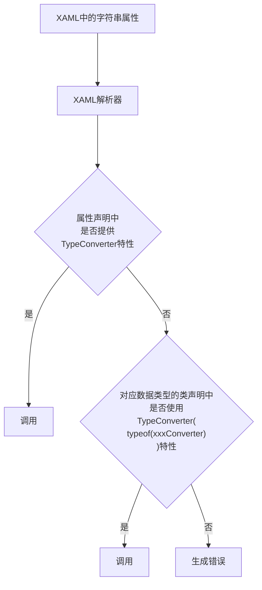
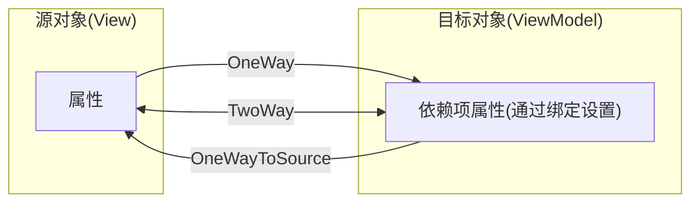
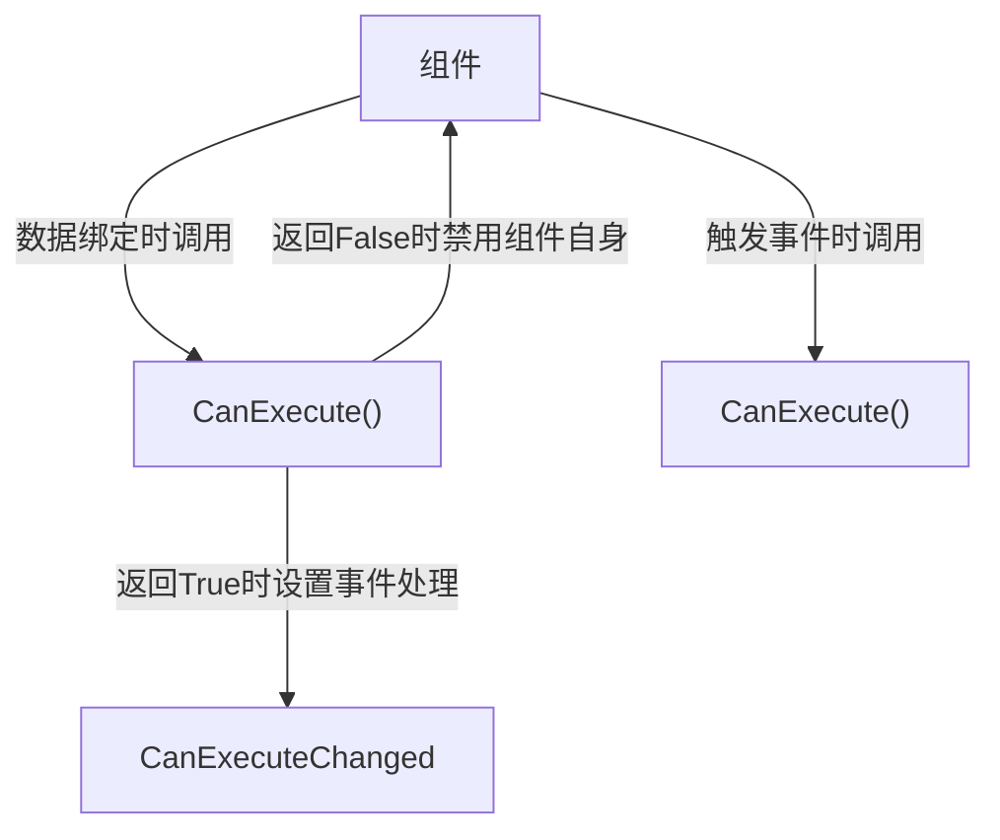

## 设计流程

参考：《亲爱的界面：让用户乐于使用、爱不释手（第2版）》

产品开发的三个阶段：研究、设计和实施。

### 研究

开始设计产品时，搞清楚产品的**用户对象**是谁，你所**要解决的问题**是什么。

### 设计

这时你要考虑如何解决用户的问题。设计出方案，并在编写代码之前对其进行测试。**在纸上修正错误比通过代码要容易得多**。

从**设计的角度**来看，这一阶段可能是整个开发过程中**最重要的部分**。

### 实施

创建产品，并持续进行测试。这一阶段要回答的问题包括：

- 前期假设是否正确？
- 设计方案是否有效？
- 产品运行时人们如何与它进行交互？
- 方案的实施结果是否满意？
- 产品如何对错误和真实的数据进行处理？
- 它的运行表现是否够好？

## WPF 概述

WPF 中所有绘图相关的操作是由 DirectX 完成的，仅有处理和路由输入信息以及区分哪个应用程序实际拥有屏幕的哪一部分是依赖 User32 的。

### 像素单位

WPF 窗口以及其中的所有元素都使用与设备无关的单位进行度量。一个与设备无关的单位被定义为1/96英寸。实际显示的大小为：物理单位尺寸 = 设备无关单位尺寸 \* 系统 DPI。

### WPF 体系结构


- PresentationFramework.dll 包含 WPF 顶层的类型，包括那些表示窗口、面板以及其他类型控件的类型。它还实现了高层编程抽象，如样式。开发人员直接使用的大部分类都来自这个程序集。
- PresentationCore.dll 包含了基础类型，如 UIElement 类和 Visual 类，所有形状类和控件类都继承自这两个类。如果不需要窗口和控件抽象层的全部特征，可使用这一层，而且仍能利用 WPF 的渲染引擎。
- WindowsBase.dll 包含了更多基本要素，这些要素具有在 WPF 之外重用的潜能，如 DispatcherObject 类和 DependencyObject 类，这两个类引入了依赖项属性。
- milcore.dll 是 WPF 渲染系统的核心，也是媒体集成层（Media Integration Layer，MIL）的基础。其合成引擎将可视化元素转换为 Direct3D 所期望的三角形和纹理。尽管将 milcore.dll 视为 WPF 的一部分，但它也是 Windows Vista 和 Windows7 的核心系统组件之一。实际上，桌面窗口管理器（Desktop Window Manager，DWM）使用 milcore.dll 渲染桌面。
- VindowsCodecs.dll 是一套提供图像支持的低级API（例如处理、显示以及缩放位图和 JPEG 图像）。
- Direct3D 是一套低级 API，WPF 应用程序中的所有图形都由它进行渲染。
- User32 用于决定哪些程序实际占有桌面的哪一部分。所以它仍被包含在 WPF 中，但不再负责渲染通用控件。

#### 类层次结构


1. System.Threading.DispatcherObject
   WPF 应用程序使用单线程亲和（Single-Thread Affinity，STA）模型，即整个用户界面由单个线程拥有。从另一个线程与用户界面元素进行交互是不安全的。为方便使用此模型，每个 WPF 应用程序由协调消息（键盘输入、鼠标移动乃至框架处理，如布局）的调度程序管理。

   通过继承自 DispatcherObject 类，用户界面中的每个元素都可以检查代码是否在正确的线程上运行，并能通过访问调度程序为用户界面线程封送代码。

2. System.Windows.DependencyObject

   在 WPF 中，主要通过属性与屏幕上的元素进行交互。在早期设计阶段，WPF 的设计者决定创建一个更加强大的属性模型，该模型支持许多特性，例如更改通知、默认值继承以及减少属性存储空间。最终结果就是依赖项属性（dependency property）特性。

   通过继承自 DependencyObject 类，WPF 类可获得对依赖项属性的支持。

3. System.Windows.Media.Visual

   在 WPF 窗口中显示的每个元素本质上都是 Visual 对象。可将 Visual 类视为绘图对象，其中封装了绘图指令、如何执行绘图的附加细节（如剪裁、透明度以及变换设置）以及基本功能（如命中测试)。Visual 类还在托管的 WPF 库和渲染桌面的 milcore.dll 程序集之间提供了链接。

   任何继承自 Visual 的类都能在窗口上显示出来。如果更愿意使用轻量级的 API 创建用户界面，而不想使用 WPF 的高级框架特征，直接对 Visual 对象进行编程。

4. System.Windows.UlElement

   UIElement 类增加了对 WPF 本质特征的支持，如布局、输入、焦点和事件（WPF 团队使用首字母缩写词 LIFE 来表示）。例如，这里定义两个步骤的测量和排列布局过程。在该类中，原始的鼠标单击和按键操作被转换为更有用的事件，如 MouseEnter 事件。与属性类似，WPF 实现了增强的称为路由事件（routed event）的事件路由系统。最后，UIElement 类中还添加了对命令的支持。

5. System.Windows.FrameworkElement

   FrameworkElement 类是 WPF 核心继承树中的最后一站。该类实现了一些全部由 UIElement 类定义的成员。例如，UIElement 类为 WPF 布局系统设置了基础，但 FrameworkElement 类提供了支持它的重要属性（如 HorizontalAlignment 和 Margin 属性）。UIElement 类还添加了对数据绑定、动画以及样式等核心特性的支持。

6. System.Windows.Shapes.Shape

   基本的形状类（如 Rectangle 类、Polygon 类、Ellipse 类、Line 类以及 Path 类）都继承自该类。可将这些形状类与更传统的 Windows 小组件（如按钮和文本框）结合使用。

7. System.Windows.Controls.Control

   控件（control）是可与用户进行交互的元素。控件显然包括 TextBox 类、Button 类和 ListBox 类等。Control 类为设置字体以及前景色与背景色提供了附加属性。但最令人感兴趣的细节是模板支持，通过模板支持，可使用自定义风格的绘图替换控件的标准外观。

8. System.Windows.Controls.ContentControl

   ContentControl 类是所有具有单一内容的控件的基类，包括简单的标签乃至窗口的所有内容。该模型的特点是控件中的单一内容可以是普通字符串乃至具有其他形状和控件组合的布局面板。

9. System.Windows.Controls.ItemsControl

   ItemsControl 类是所有显示选项集合的控件的基类，如 ListBox 和 TreeView 控件。列表控件十分灵活一例如，使用 ItemsControl 类的内置特征，可将简单的 ListBox 控件变换成单选按钮列表、复选框控件列表、平铺的图像或是您所选择的完全不同的元素的组合。实际上，WPF 中的菜单、工具栏以及状态栏都是特定的列表，并且实现它们的类都继承自 ItemsContorl 类。

10. System.Windows.Controls.Panel

    Panel 类是所有布局容器的基类，布局容器是可包含一个或多个子元素、并按特定规则对子元素进行排列的元素。这些容器是 WPF 布局系统的基础，要以最富有吸引力、最灵活的方式安排内容，使用这些容器是关键所在。在第3章将详述 WPF 布局系统。


## XAML

XAML（Extensible Application Markup Language 的简写，发音为“zammel”）是用于实例化 .NET 对象的标记语言。

BAML（Binary Application Markup Language, 二进制应用程序标记语言）是 XAML 的二进制表示。当在 Visual Studio 中编译 WPF  应用程序时，所有 XAML 文件都被转换为 BAML ，这些 BAML 然后作为资源被嵌入到最终的 DLL 或 EXE 程序集中。

### XAML 基础

- XAML 文档中的每个元素都映射为 .NET 类的一个实例。元素的名称也完全对应于类名。例如，元素 \<Button> 指示 WPF 创建 Button 对象。
- 与所有 XML 文档一样，可在一个元素中嵌套另一个元素。但嵌套通常是一种表示“包含”的方法——换句话说，如果在一个 Grid 元素中发现一个 Button 元素，那么用户界面可能包括一个在其内部包含一个 Button 元素的 Grid 元素。
- 可通过特性（attribute）设置每个类的属性（property）。但在某些情况下，特性不足以完成这项工作。对于此类情况，需要通过特殊的语法使用嵌套的标签（tag）。

#### 代码隐藏类

##### InitializeComponent() 方法

InitializeComponent() 方法在源代码中不可见，因为它是在编译应用程序时自动生成的。本质上，InitializeComponent() 方法的所有工作就是调用 System.Windows.Application 类的 LoadComponent() 方法。LoadComponent() 方法从程序集中提取 BAML (编译过的 XAML），并用它来构建用户界面。**当解析 BAML 时，它会创建每个控件对象，设置其属性，并关联所有事件处理程序**。

##### 简单属性与类型转换器



注：

与所有基于 XML 的语言一样，XAML 也区分大小写。这意味着不能用 \<button> 替代 \<Button> 。然而，类型转换器通常不区分大小写，这意味着 `Foreground="White"` 和 `Foreground="white"` 具有相同的效果。

#### 特殊字符与空白

XAML 受到 XML 规则限制。对于一些特殊符号，想要直接使用，需用字符实体来表示。

| 特殊字符    | 字符实体 |
| ----------- | -------- |
| 小于号（≤） | \&lt;    |
| 大于号（>） | \&gt;    |
| & 符号（&） | \&amp;   |
| 引号（"）   | \&quot;  |

希望在按钮文本中包含一系列空格。在这种情况下，需要为元素使用 `xml:space="preserve"` 特性。`xml:space` 特性是 XML 标准的一部分，是一个要么包括全部、要么什么都不包括的设置。一旦使用了该设置，元素内的所有空白字符都将被保留。

### 创建 WPF 应用程序的三种方式

- 只使用代码

  这是在 Visual Studio 中为 Windows 窗体应用程序使用的传统方法。

- 使用代码和未编译过的标记（XAML）

  这种方式在运行时使用 System.Windows.Markup 名称空间中的 XamlReader 类，从 XAML 文件中加载部分用户界面。

- 使用代码和编译过的标记（BAML）

  使用代码和编译过的标记（BAML）。对于 WPF 而言这是一种更好的方式，也是 Visual Studio 支持的一种方式。这种方式为每个窗口创建一个 XAML 模板，这个 XAML 模板被编译为 BAML，并嵌入到最终的程序集中。编译过的 BAML 在运行时被提取出来，用于重新生成用户界面。


## 布局

### 布局原则

- 不应显式设定元素（如控件）的尺寸。

  元素应当可以改变尺寸以适合它们的内容。例如，当添加更多的文本时按钮应当能够扩展。可通过设置最大和最小尺寸来限制可以接受的控件尺寸范围。

- 不应使用屏幕坐标指定元素的位置。

  元素应当由它们的容器根据它们的尺寸、顺序以及（可选的）其他特定于具体布局容器的信息进行排列。如果需要在元素之间添加空白空间，可使用 Margin 属性。

- 布局容器的子元素“共享”可用的空间。

  如果空间允许，布局容器会根据每个元素的内容尽可能为元素设置更合理的尺寸。它们还会向一个或多个子元素分配多余的空间。

- 可嵌套的布局容器。

  典型的用户界面使用 Grid 面板作为开始，Grid 面板是 WPF 中功能最强大的容器，Grid 面板可包含其他布局容器，包含的这些容器以更小的分组排列元素，比如带有标题的文本框、列表框中的项、工具栏上的图标以及一列按钮等。

### 核心布局面板

| 名称        | 说明                                                         |
| ----------- | ------------------------------------------------------------ |
| StackPanel  | 在水平或垂直的堆栈中放置元素。这个布局容器通常用于更大、更复杂窗口中的一些小区域 |
| WrapPanel   | 在一系列可换行的行中放置元素。在水平方向上， WrapPanel 面板从左向右放置条目，然后在随后的行中放置元素。在垂直方向上，WrapPanel 面板在自上而下的列中放置元素，并使用附加的列放置剩余的条目 |
| DockPanel   | 根据容器的整个边界调整元素                                   |
| Grid        | 根据不可见的表格在行和列中排列元素，这是最灵活、最常用的容器之一 |
| UniformGrid | 在不可见但是强制所有单元格具有相同尺寸的表中放置元素，这个布局容器不常用 |
| Canvas      | 使用固定坐标绝对定位元素。这个布局容器与传统 Windows 窗体应用程序最相似，但没有提供锚定或停靠功能。因此，对于尺寸可变的窗口，该布局容器不是合适的选择。如果选择的话，需要另外做一些工作 |

## MVVM

### 各层级间的关系

[参考](https://learn.microsoft.com/zh-cn/xamarin/xamarin-forms/creating-mobile-apps-xamarin-forms/summaries/chapter18)

**模型对视图模型未知，视图模型对视图未知。** 这三层通常使用以下机制相互连接：


在许多**较小**的程序（**甚至更大**的程序）中，模型通常是**不存在的**，或它的功能**集成到视图模型中**。

> [!Note]
>
> - View 层仅通过数据绑定与 ViewModel 建立联系，所以 ViewModel 对 View 未知。
> - 当 Model 作为 ViewModel 的成员对象时，Model 对 ViewModel 未知。

## 绑定

### 绑定到非元素对象

#### Source

该属性是指向源对象的引用。换句话说，是提供数据的对象。

#### RelativateSource

编写控件模板时，子元素可在 RelativateSource 绑定的路径下查找和绑定对象。

#### DataContext

没有上述两个属性源指定对象时，就从该元素树中查找。在符合要求的元素中使用第一个有非空的 DataContext 属性的元素。

### 绑定模式

`Binding.Mode`的属性设置。

| 名称           | 说明                                                         |
| -------------- | ------------------------------------------------------------ |
| OneWay         | 当源属性变化时更新目标属性                                   |
| TwoWay         | 当源属性变化时更新目标属性，并且当目标属性变化时更新源属性   |
| OneTime        | 最初根据源属性值设置目标属性。然而，其后的所有改变都会被忽略（除非绑定被设置为一个完全不同的对象或者调用 BindingExpression.UpDateTarget() 方法，正如稍后介绍的那样）。通常，如果知道源属性不会变化，可使用这种模式降低开销 |
| OneWayToSource | 与 OneWay 类型类似，但方向相反。当目标属性变化时更新源属性（这看起来有点像向后传递)，但目标属性永远不会被更新 |
| Default        | 此类绑定依赖于目标属性。既可以是双向的（对于用户可以设置的属性，如 TextBox.Text 属性），也可以是单向的（对于所有其他属性）。除非明确指定了另一种模式，否则所有绑定都使用该方法 |

数据流向图



### 手动编写绑定

#### ICommand 绑定

Click 绑定类的实现

```c#
// 命令类
public class RelayCommond : ICommand
{
    /// <summary>
    /// 命令是否能够执行
    /// </summary>
    readonly Func<bool> _canExecute;
    /// <summary>
    /// 命令需要执行的方法
    /// </summary>
    readonly Action _execute;

    public RelayCommond(Action action, Func<bool> canExecute)
    {
        _execute = action;
        _canExecute = canExecute;
    }

    public bool CanExecute(object parameter)
    {
        if (_canExecute == null)
        {
            return true;
        }
        return _canExecute();
    }

    public void Execute(object parameter)
    {
        _execute();
    }

    public event EventHandler CanExecuteChanged
    {
        add
        {
            if (_canExecute != null)
            {
                CommandManager.RequerySuggested += value;
            }
        }
        remove
        {
            if (_canExecute != null)
            {
                CommandManager.RequerySuggested -= value;
            }
        }
    }
}
```

#### INotifyPropertyChanged 绑定

View 可从绑定数据更新的条件：

1. 需绑定的类的属性是 public 且要实现 `get` 方法。
2. 类需实现 `INotifyPropertyChanged` 接口。

ViewModel 创建方法

```c#
class ViewModel : INotifyPropertyChanged
{
    // 关键代码
 	void LoginFunc()
    {
         // 实现   
    }

    bool CanLoginExecute()
    {
        return true;
    }

    public ICommand LoginAction
    {
        get
        {
            return new RelayCommand(LoginFunc, CanLoginExecute);
        }
    }   
}
```

View 绑定

```xaml
<!-- DataContext默认绑定ViewModel实例 -->
<Button Command="{Binding LoginAction}" />
```

## 模板类型

### 控件模板

用于确定如何渲染控件。

### 数据模板

用于从对象中提取数据，并在内容控件或列表控件的各项中显示数据。

### 面板模板

用于控制列表控件（继承至 ItemsControl 类的控件）中各项的布局。

## ICommand 接口

### 执行逻辑



