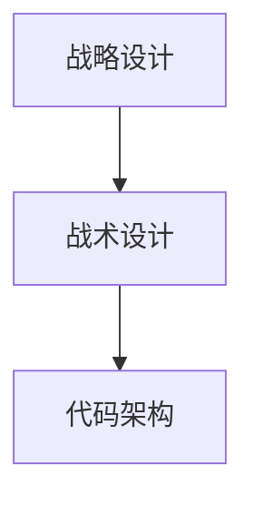
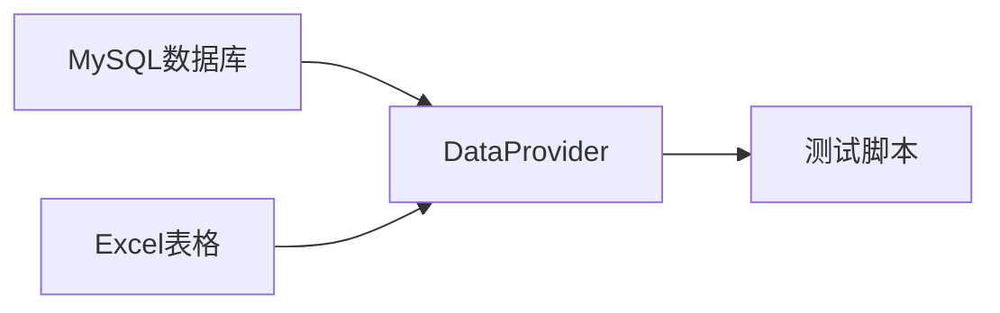
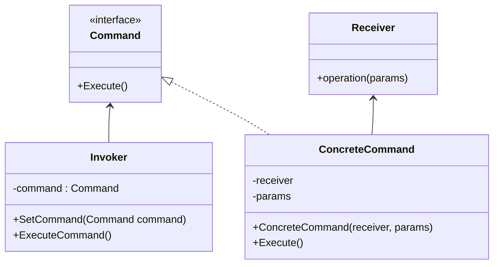
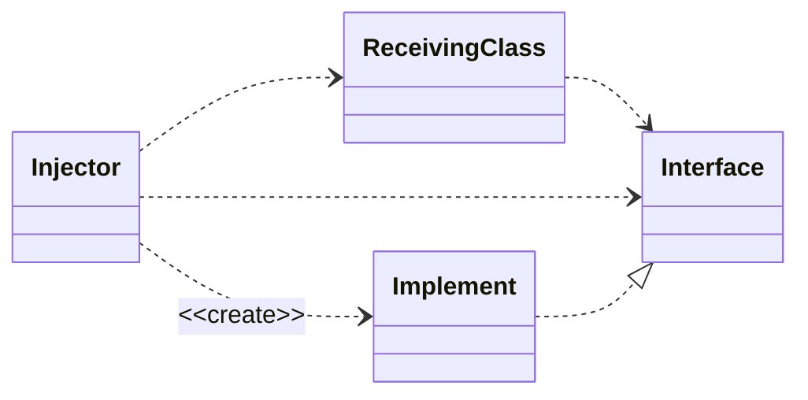
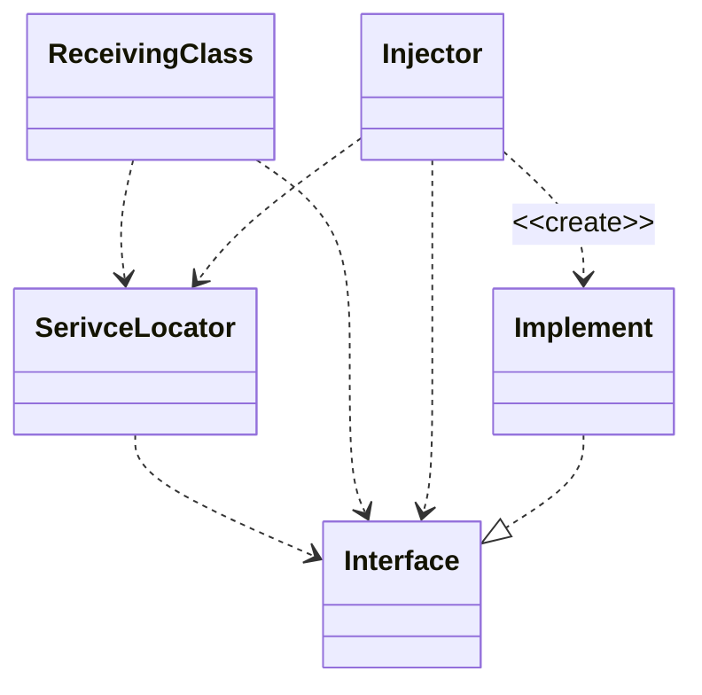

## DDD（领域驱动开发）

### 软件的层级

大部分程序都是多层架构，一般为三层：

- 表示层：负责把数据展示出来，提供与业务逻辑层的交互命令。
- 业务逻辑层：实现具体的业务逻辑，经常与数据交互还会划分一个数据访问层（Data Access Layer，DAL）。
- 数据层

WPF（Windows Presentation Foundation）用于表示层开发。

### 领域驱动设计 DDD 在 B 端营销系统的实践

[参考](https://mp.weixin.qq.com/s/Iyk48w8vbzofIrzKBwLCAQ?poc_token=HOTCGGejVFUdEPrq7C3-QFfvCGQNhCdEkt37j62S)

软件设计流程



战略设计：确定用例，统一语言和划分边界。

战术设计：概念模型转化成类（代码）模型。

代码架构：将系统设计映射为系统实现。


## TDD（测试驱动开发）

[参考](https://zh.wikipedia.org/wiki/%E6%B5%8B%E8%AF%95%E9%A9%B1%E5%8A%A8%E5%BC%80%E5%8F%91)

测试驱动开发是戴两顶帽子思考的开发方式：先戴上实现功能的帽子，在测试的辅助下，快速实现其功能；再戴上重构的帽子，在测试的保护下，通过去除冗余的代码，提高代码品质。测试驱动着整个开发过程：首先，**驱动代码的设计和功能的实现**；其后，**驱动代码的再设计和重构**。

### TDD 概要

[参考](https://github.com/hxfirefox/blog/blob/master/TDD/img/oo2rd_pub_1.png)


#### What

以先写测试用例的方式定义出代码的行为，然后缩写产品代码使得用例通过，从而实现功能代码

#### Why

- 通过测试来正确的反应业务需求
- 需求仅仅为了完成测试，不会产生多余的代码
- 对功能完成情况给出快速及时反馈，帮助开发小步快跑，每一步都是正确的
- 可重复的，代价低廉的自动化测试时刻帮助验证程序的正确性

#### How

- 任务分解
- 转化成为测试
- 使测试通过
- 要点
  - 测试先行
  - 小测试
  - 快速反馈

### 创建一个 C# 的 TDD 项目

[参考](https://learn.microsoft.com/zh-cn/visualstudio/test/walkthrough-creating-and-running-unit-tests-for-managed-code?view=vs-2022)

#### 在已有项目上创建测试项目

1. 在 Visual Studio 的“开始”窗口上，选择“创建新项目” 。

   

2. 在搜索框输入 ”MSTest 单元测试项目“ 后搜索并选择。

   

3. 选择 ”添加到解决方案“

   

4. 在“解决方案资源管理器”中，选择测试项目下的“依赖项”，然后从右键单击菜单中选择“添加引用”（或“添加项目引用”）。

   

   

5. 在“引用管理器”对话框中，展开“项目”，选择“解决方案”，然后选中对应的项目。

   

#### 创建测试类和测试方法

只需在需要作为测试的类和方法上分别加上 `[TestClass]` 特性和 `[TestMethod]` 属性。


### 测试

#### 单元测试的五个级别

[参考](https://www.zhihu.com/question/27313846/answer/120164282)

1. Level 1：正常流程可用，即一个函数在输入正确的参数时，会有正确的输出
1. Level 2：异常流程可抛出逻辑异常，即输入参数有误时，不能抛出系统异常，而是用自己定义的逻辑异常通知上层调用代码其错误之处
1. Level 3：极端情况和边界数据可用，对输入参数的边界情况也要单独测试，确保输出是正确有效的
1. Level 4：所有分支、循环的逻辑走通，不能有任何流程是测试不到的
1. Level 5：输出数据的所有字段验证，对有复杂数据结构的输出，确保每个字段都是正确的

一般只做到 Level 2，重要系统或者底层服务，要做到 Level 3或 Level 4。极为关键的才做到 Level 5.

#### 3条简单的规则

1. 除非已经编写了一个不能通过的单元测试，否则不编写任何产品代码；

2) 只要编写能够正好导致测试不通过或者编译失败的单元测试就够了；

3) 只要编写能够正好使失败的单元测试通过的产品代码就够了。

#### 作用

1. 保证程序中的每一项功能都有测试来验证它的操作的正确性；

2. 迫使我们从调用者的视角去观察将要编写的程序，以设计出便于调用的软件；

3. 首先编写测试迫使我们解除软件中的耦合；
4. 测试可以作为一种非常有价值的文档，帮助其人了解如何使用代码。

#### 测试方法

##### 基于意图编程

先在测试中陈述意图，并使你的意图尽可能地简单、易读。

##### 单元测试

是用来验证系统中单个机制的白盒测试（white-box test）。

##### 验收测试

是用来验证系统满足客户需求的黑盒测试（black-box test）；是关于一项特性的最终文档。一旦编写完成了验证一项特性的验收测试，就可以阅读那些验收测试来真正地理解这项特性。即验收测试是真正的需求文档。

[FitNesse](https://fitnesse.org/FrontPage.html) 可以以简单 Web 页面的形式来编写每个验收测试，并从 Web 浏览器来访问和运行。

#### 数据驱动测试

从数据库其他数据源中获取测试用例。

优势：学习和迁移成本低 都会比较低。

数据流向图



通过 DataProvider 将不同数据转换为统一的格式，便于解耦合和测试脚本使用。

##### 最佳实践

[参考](https://learn.microsoft.com/zh-cn/dotnet/core/testing/unit-testing-best-practices)

- 测试的名称应包括三个部分：要测试的方法的名称、测试的方案、调用方案时的预期行为。

- 单元测试步骤：
  1. Arrange：安排对象，根据需要对其进行创建和设置，
  2. Act：作用于对象，
  3. Assert：断言某些项按预期进行。 

- 编写单元测试时，请避免手动字符串串联、逻辑条件（例如 `if`、`while`、`for` 和 `switch`）以及其他条件。

- 在编写测试时，请尝试每次测试只包含一个操作。 

例：

```c#
[TestMethod]
// 以下每个为一次测试
[DataRow("0,0,0", 0)]
[DataRow("0,1,2", 3)]
[DataRow("1,2,3", 6)]
// 方法名称_测试方案_预期行为
public void Add_MultipleNumbers_ReturnsSumOfNumbers(string input, int expected)
{
    // Arrange
    var stringCalculator = new StringCalculator();
	// Act
    var actual = stringCalculator.Add(input);
	// Assert
    Assert.Equal(expected, actual);
}
```

[数据源属性](https://learn.microsoft.com/zh-cn/visualstudio/test/how-to-create-a-data-driven-unit-test?view=vs-2022)

[DataRow](https://learn.microsoft.com/zh-cn/visualstudio/test/how-to-create-a-data-driven-unit-test?view=vs-2022#inline-data-driven-test)

使用指定的值连续运行。

```c#
[TestMethod]
[DataRow(1, 1, 2)]
[DataRow(2, 2, 4)]
[DataRow(3, 3, 6)]
[DataRow(0, 0, 1)] // The test run with this row fails
public void AddIntegers_FromDataRowTest(int x, int y, int expected)
{
    var target = new Maths();
    int actual = target.AddIntegers(x, y);
    Assert.AreEqual(expected, actual,
        "x:<{0}> y:<{1}>",
        new object[] {x, y});
}
```

[DynamicData](https://learn.microsoft.com/zh-cn/visualstudio/test/how-to-create-a-data-driven-unit-test?view=vs-2022#member-data-driven-test)

使用数据成员的值作为输入。

```c#
public static IEnumerable<object[]> AdditionData
{
    get
    {
        return new[]
        { 
            new object[] { 1, 1, 2 },
            new object[] { 2, 2, 4 },
            new object[] { 3, 3, 6 },
            new object[] { 0, 0, 1 }, // The test run with this row fails
        };
    }
}

[TestMethod]
[DynamicData(nameof(AdditionData))]
public void AddIntegers_FromDynamicDataTest(int x, int y, int expected)
{
    var target = new Maths();
    int actual = target.AddIntegers(x, y);
    Assert.AreEqual(expected, actual,
        "x:<{0}> y:<{1}>",
        new object[] {x, y});
}
```

[DataSource](https://learn.microsoft.com/zh-cn/visualstudio/test/how-to-create-a-data-driven-unit-test?view=vs-2022#specify-the-datasourceattribute)

使用指定源的数据。

```c#
[TestMethod]
/*
三种不同的构造函数
[DataSource(dataSourceSettingName)]

[DataSource(connectionString, tableName)]

[DataSource(
    dataProvider,
    connectionString,
    tableName,
    dataAccessMethod
    )]
*/
[DataSource(@"Provider=Microsoft.SqlServerCe.Client.4.0; Data Source=C:\Data\MathsData.sdf;", "Numbers")]
public void AddIntegers_FromDataSourceTest()
{
    var target = new Maths();

    // Access the data
    int x = Convert.ToInt32(TestContext.DataRow["FirstNumber"]);
    int y = Convert.ToInt32(TestContext.DataRow["SecondNumber"]);
    int expected = Convert.ToInt32(TestContext.DataRow["Sum"]);
    int actual = target.AddIntegers(x, y);
    Assert.AreEqual(expected, actual,
        "x:<{0}> y:<{1}>",
        new object[] {x, y});
}
```

## 设计模式

### 命令模式



Invoker 包含一个或多个 Command，是用于执行一系列的指令组合。

Command 及其对应实现是为了将指令转发给具体的执行者。

Receiver 是执行具体命令的执行者，其类名不一定是 Receiver，可以是任何类的实例。

### 依赖倒转原则

1. 高层模块不应该依赖低层模块。两个都应该依赖抽象。
2. 抽象不应该依赖细节。细节应该依赖抽象。

**依赖倒转是面向对象设计的标志**。如果编写时考虑的都是如何针对抽象编程而不是针对细节编程，即程序中**所有的依赖关系都是终止于抽象类或者接口**，那就是面向对象的设计，反之那就是过程化的设计了。

### 发布-订阅模式

定义对象间的一种一对多的依赖关系，当一个对象的状态发生改变时，所有依赖于它的对象都得到通知并被自动更新。
在以下任一情况下可以使用观察者模式：

- 当一个抽象模型有两个方面，其中一个方面依赖于另一方面。将这二者封装在独立的对象中以使它们可以各自独立地改变和复用。
- 当对一个对象的改变需要同时改变其它对象，而不知道具体有多少对象有待改变。
- 当一个对象必须通知其它对象，而它又不能假定其它对象是谁。换言之，你不希望这些对象是紧密耦合的。

#### [Event Aggregator](https://www.martinfowler.com/eaaDev/EventAggregator.html)

将多个对象中的事件导入一个对象，以简化客户端的注册。即对发布者（publishers）和订阅者（subscribers）进行解耦合。


优点：

Aggregators 的 observers 就在不需要注册许多单独的事件类型。

缺点：

代价是可能会收到对 observers 没有任何实质性影响的事件通知。

> [!Note]
>
> Observer 模式，也被称做依赖（Dependents），发布-订阅（Publish-Subscribe）模式。[^2]


## IOC（控制反转）

[参考](https://learn.microsoft.com/zh-cn/dotnet/communitytoolkit/mvvm/ioc)

使用 MVVM 模式提高应用程序代码库中的模块化程度的最常用模式是使用某种形式的反转控制。其中有一种最常见的解决方案使用 DI（[依赖关系注入](https://www.freecodecamp.org/chinese/news/a-quick-intro-to-dependency-injection-what-it-is-and-when-to-use-it/)），该解决方案存在于创建多个注入后端类的服务（即以参数的形式传递给 ViewModel 构造函数）的过程中，这允许使用这些服务的代码不依赖这些服务的实现详细信息，并且也可以轻松地交换这些服务的具体实现。 

所需包：[](https://www.nuget.org/packages/Microsoft.Extensions.DependencyInjection/)

### 配置和解析服务

```c#
public sealed partial class App : Application
{
    public App()
    {
        Services = ConfigureServices();

        InitializeComponent();
    }

    /// <summary>
    /// 获取当前使用中的 <see cref="App"/> 实例
    /// </summary>
    public new static App Current => (App)Application.Current;

    /// <summary>
    /// 当前App实例中的 <see cref="IServiceProvider"/> 实例
    /// </summary>
    public IServiceProvider Services { get; }

    /// <summary>
    /// 注册依赖的函数
    /// </summary>
    private static IServiceProvider ConfigureServices()
    {
        var services = new ServiceCollection();
		
        // 注册接口和对应的实现类
        services.AddSingleton<InterfaceClass, ImplClass>();
        
        // 注册视图模型
		services.AddSingleton<XxxViewModel>();
        
        return services.BuildServiceProvider();
    }
}
```

### 使用

```c#
InterfaceClass c = App.Current.Services.GetService<InterfaceClass>();

var vm = App.Current.Services.GetService<XxxViewModel>();
```

### 区别

`AddSingleton()` 在第一次请求时创建服务的单个实例，并在需要该服务的所有位置复用该实例（单例模式）。

`AddTransient()` 在第每次请求时创建服务的一个实例。

`AddScoped()` 在给定的 http 请求范围内获得相同的实例，但跨不同的 http 请求获得新实例。

### IOC 的注入方式

依赖注入的基本思想是使用一个单独的对象（即注入器[^1]）来填充接收类中的依赖对象。



使用服务定位

服务定位背后的基本思想是拥有保存所有依赖对象的单例，它有一个能返回依赖对象的方法。



### IOC 的三种实现方式

#### Interface Injection（接口注入）

通过接口提供的注入方法来注入依赖对象。

例：

```c#
interface Inject {
    // 注入接口
    public void SetDependency(Object o);
}

// 依赖对象
class B {
    // ...
}

// 接收方
class A : Inject {
    B b;
    // 注入接口的具体实现
    public override void SetDependency(Object o) {
        this.b = o as B;
    }
    // ...
}
```

#### Setter Injection（Setter 注入）

通过接收方提供的注入方法注入依赖对象。

例：

```c#
// 依赖对象
class B {
    // ...
}

// 接收方
class A {
    B b;
    // Setter方法
    public void SetDependency(B b) {
        this.b = b;
    }
    // ...
}
```

#### Constructor Injection（构造器注入）

通过向接收方的构造函数传参注入依赖对象。

例：

```c#
// 依赖对象
class B {
    //...
}

// 接收方
class A {
    B b;
    // 构造器注入
    public A(B b) {
        this.b = b;
    }
    // ...
}
```


[^1]: Injector，也称 assembler、container、provider 或 factory。负责把服务引入给客户。
[^2]: 5.7 Observer（观察者）- 对象行为型模式 P~194~ | 设计模式：可复用面向对象软件基础