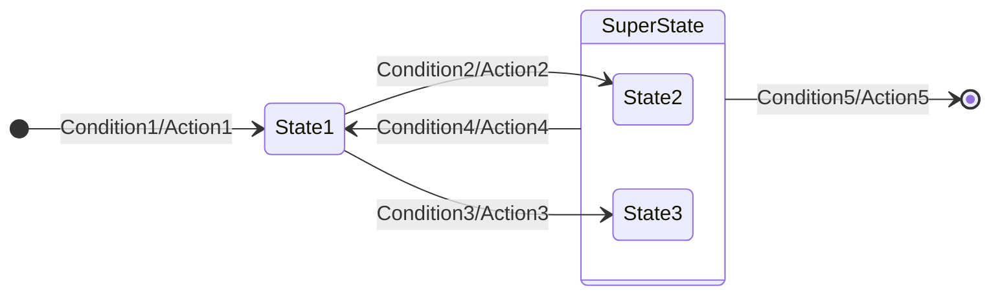
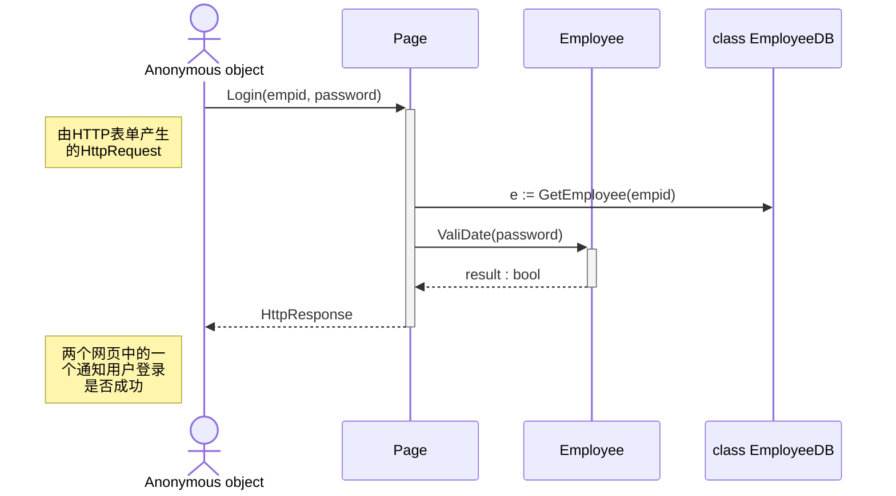

## 项目开发规范

[参考](https://learn.microsoft.com/zh-cn/dotnet/standard/design-guidelines/)

### 类设计

#### 最佳实践

1. 类是暴露抽象最优先的选择。因为接口一旦发布，其成员将永远固定。所以要优先定义类而不是接口。

2. 要用抽象类而不是用接口来解除契约与实现之间的耦合，除非接口永不变[^7]。

3. 一个接口只做一件事情。

4. 通过接口来实现多重继承，但要避免记号接口（没有成员的接口）[^8]。

5. 仅把最长的重载成员定义成重载成员中唯一的虚成员，而较短的重载只是调用一下较长的重载。

   ```c#
   public class String{
       public int Indexof(string s){
           return Indexof(s,0);
       }
   	public int Indexof(string s,int startIndex){
           return Indexof(s,startIndex,s.Length);
       }
   	public virtual int Indexof(string s,int startIndex,int count){
           //do real work here
       }
   }
   ```

   

6. 要优先使用成员重载，而不是定义有默认参数的成员[^9]。

## 项目文档

### C# 的注释文档

[参考](https://learn.microsoft.com/zh-cn/dotnet/csharp/language-reference/xmldoc/)

注释文档可以方便开发人员查看类和 API 的详细信息；也可以通过相关工具[^1][^2][^3]生成网页或 PDF 文件的形式的可读文档。

#### 参考格式

在 VS 中键入`///`后，会自动生成一个注释文档框架。

```c#
/// <summary>
/// 这是一个示例类，用于演示注释文档的格式
/// </summary>
public class ExampleClass
{
    /// <summary>
    /// 这是一个示例方法，用于演示注释文档的格式
    /// </summary>
    /// <param name="param1">参数1的说明</param>
    /// <param name="param2">参数2的说明</param>
    /// <returns>返回值的说明</returns>
    /// <exception cref="System.ArgumentException">如果参数不符合要求，则会抛出 ArgumentException 异常</exception>
    /// <remarks>
    /// 这个方法做了什么事情的额外说明
    /// </remarks>
    public int ExampleMethod(int param1, string param2)
    {
        // 方法的具体实现
        return 0;
    }
}
```

在上面的示例中，使用了 `<summary>` 标记来描述类和方法的概要信息，`<param>` 标记来描述方法的参数信息，`<returns>` 标记来描述方法的返回值信息，`<exception>` 标记来描述可能抛出的异常信息，`<remarks>` 标记来提供额外的说明信息。

PS: [所有的文档标记](https://learn.microsoft.com/zh-cn/dotnet/csharp/language-reference/xmldoc/recommended-tags)、[详细示例](https://learn.microsoft.com/zh-cn/dotnet/csharp/language-reference/xmldoc/examples)

#### 构建在线或 PDF 文档

采用 DocFX 构建网站[^4]。

##### 第一步 配置参数

1. 建立一个文件夹（文件位置与需要构建网址的项目位置无关）作为构建和生成网站的根目录。

2. 在 CMD 中定位到该文件夹下，之后输入 `docfx init` 初始化构建工具。

   docfx 初始化配置时会出现以下选项

   

   第一个为网站名，直接回车默认为 `mysite`。

   第二个为是否生成 API 文档，直接默认回车。

   第三个为项目位置（即项目相对于该文件夹的位置），他是以当前文件夹的上一级为起始位置，默认回车文件路径为 `../src`。

   第四个为 md 文档的位置。可以在该目录下编写 md 文件，构建时会生成对应的网页。

   第五个为是否允许搜索引擎爬虫爬取，输入 `n` 回车。

   第六个为是否生成 PDF 文档，默认回车。

   

   选项输入完后，生成的配置文件

   

##### 第二步 生成并访问

1. 输入

   ```cmd
   docfx C:\Users\Lenovo\Documents\我的文档\工作\docfx_web_demo\docfx.json --serve -p 9020
   ```

   构建在线服务器。`-p` 指定端口，没有指定时默认为8080。`-n` 指定服务器 IP，没有时仅本机可以访问。

2. 访问 `http://localhost:9020` 即可。

## 框架设计

###  UML

#### 状态图

描述在不同状态切换的图。

##### 图表示



当两个或多个状态会在同一条件下执行同一操作转到另一状态时，可用 `SuperState` 表示。

##### 表格表示

| 当前状态   | 事件       | 新状态 | 动作    |
| ---------- | ---------- | ------ | ------- |
| 起始       | Condition1 | State1 | Action1 |
| State1     | Condition2 | State2 | Action2 |
| State1     | Condition3 | State3 | Action3 |
| SuperState | Condition4 | State1 | Action4 |
| SuperState | Condition5 | 结束   | Action5 |

在开发和维护有限状态机（FSM）方面，采用文本语言通常要比图形更容易一些。

#### 时序图

描述物件在时间序列中的交叉作用[^6]。




[^1]: [DocFX](https://dotnet.github.io/docfx/) 是适用于 .NET 的 API 文档生成器，能通过源代码和 Markdown 文件生成静态 HTML 网站或 PDF 文档。
[^2]: [Sandcastle](https://github.com/EWSoftware/SHFB) 工具为包含概念性和 API 参考页面的托管类库创建帮助文件。
[^3]: [Doxygen](https://github.com/doxygen/doxygen) 通过一系列已记录的源文件生成在线文档浏览器（使用 HTML）或离线参考手册（使用 LaTeX）。 此外，还支持生成 RTF (MS Word)、PostScript、hyperlinked PDF、compressed HTML、DocBook 和 Unix 手册页形式的输出。
[^4]: [根据注释创建API文档 | WOW-CSharp](https://github.com/sogeisetsu/WOW-Csharp/blob/master/c%23 根据注释创建API文档.md)
[^6]: [时序图 - 维基百科](https://zh.wikipedia.org/zh-cn/时序图)
[^7]: P~77~ | .NET 设计规范：约定、惯用法与模式（第2版）
[^8]: 4.6 接口设计 P~82~ | .NET 设计规范：约定、惯用法与模式（第2版）
[^9]: P~106~ | .NET 设计规范：约定、惯用法与模式（第2版）
